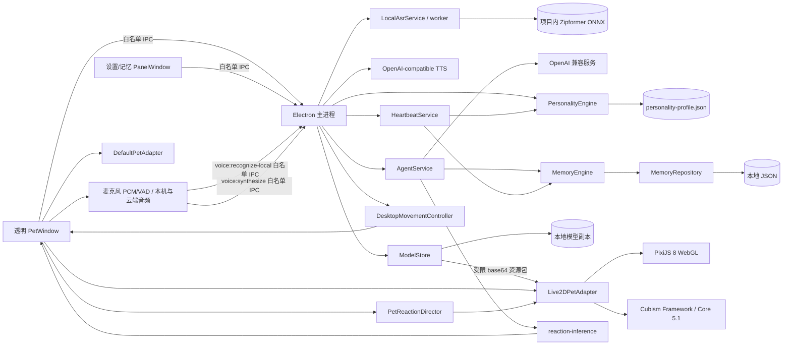
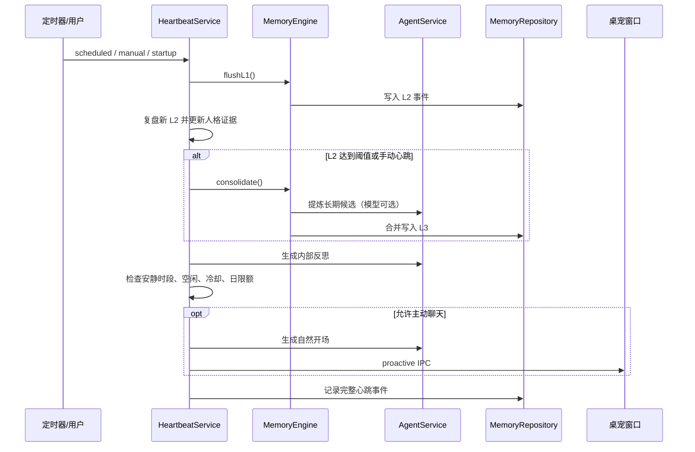
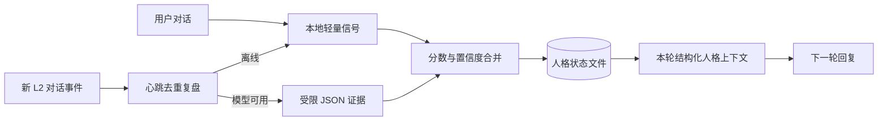
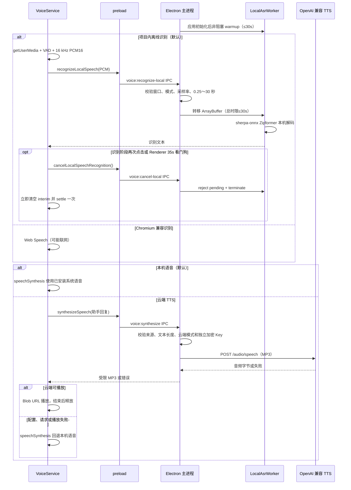

# 架构与行为细节

## 运行时分层



- `main.ts`：纯宠物窗口、右键菜单、独立控制面板、托盘、进程生命周期和 IPC 边界。
- `DesktopMovementController`：管理焦点/指针暂停原因，在显示器工作区内处理自主漫游、全局鼠标拖拽、重力下落、约 320ms 落地阶段，并每 33ms 发送连续 `PetMotionFrame` 与单一全局焦点。
- `pet-motion`：不依赖 Electron 的焦点归一化、连续运动帧计算、数值边界和落地状态归约器。
- `AgentService`：检索记忆、注入结构化人格状态、生成回复、主动开场、L2 提炼和模型人格证据提取；普通与主动回复都经本地纯函数 `inferReaction()` 生成情绪标签。
- `HeartbeatService`：定时器、迁移/整理触发、主动聊天约束和心跳审计。
- `MemoryEngine`：L1 缓冲、L2 事件化、L3 候选生成与上下文检索。
- `MemoryRepository`：版本化存储、L2/L3 原位修正与删除、可解释完整检索、聊天时态视图检索、串行写入、临时文件替换和损坏文件隔离。
- `PersonalityEngine`：从当前对话提取本地信号，在心跳中复盘新 L2，合并连续特质分数、冲突反馈、置信度与成长阶段。
- `PersonalityStore`：独立持久化人格状态和已复盘 L2 ID；使用临时文件替换，损坏时隔离并回到空白人格。
- `ModelStore`：在主进程校验并复制用户选择的 Cubism `.model3.json` 资源，持久化当前模型，并向宠物窗口返回不含本地路径的受限资源包。
- `OpenAICompatibleTtsClient`：可选云端模式的 `/audio/speech` 客户端；本机模式会在主进程边界直接拒绝云端生成，云端模式才读取独立 Base URL 和加密凭据。
- `VoiceService`：用一个幂等 operation 贯穿麦克风启动、录音、VAD、16 kHz 下采样、识别、取消和 35 秒 Renderer 看门狗；启动/静默/最长录音还有独立墙钟看门狗，权限等待不侵占录音时限，30 秒 PCM 按采样数精确裁剪。
- `LocalAsrService / local-asr-worker`：主进程分别公开模型文件状态与 `not-started / warming / ready / failed` 运行时状态，并推送到宠物窗口和控制面板。预热失败可见但不锁死重试；初始化和交互识别各有 30 秒上限，取消、超时、退出或提交失败统一收尾并允许下一次重建。
- `live2d-interaction`：不依赖 DOM/Pixi 的真实参数能力绑定、焦点阻尼、拖拽/下落/落地变形、13 项动作映射、资源时长解析与程序化兜底。
- `PetReactionDirector`：在 Renderer 内把回复情绪和文本映射为至多一个动作；处理强动作冷却、录音/拖拽优先级、最新待执行动作和手动预览优先级。
- `Live2DPetAdapter`：使用 PixiJS 8、Cubism Framework 与官方 Core 5.1 渲染内置和用户导入模型，处理真实索引参数写入、motion、自动取景、口型、视线、物理、弹簧变形与模型资源释放。
- `DefaultPetAdapter`：Live2D 加载或 WebGL 初始化失败时使用的轻量程序化后备模型，保证聊天和桌面交互仍可用。
- `PetModelAdapter`：模型渲染边界，使 Agent、桌面移动和具体 2D Runtime 彼此解耦。

## 桌面交互与移动

PetWindow 默认开启鼠标穿透，只在鼠标进入宠物本体或字幕式对话坞时临时接收事件。普通回复只短暂显示当前一句字幕；鼠标靠近或普通点击才展开输入命令条。按下左键并移动超过 5px 后，Renderer 通过白名单 IPC 启动拖拽，主进程使用全局鼠标坐标移动真实 Electron 窗口。每个移动 tick 根据窗口位移生成方向、速度和相对偏移均限制在 `[-1,1]` 的 `PetMotionFrame`；松手后窗口沿纵向加速下落，最后水平速度只保留在运动帧中驱动模型倾斜，触地后保持约 320ms `landing` 再回到空闲。

移动控制器的优先级为：拖拽 → 下落 → 落地 → 焦点/指针交互暂停 → 自主漫游。拖拽和落地不受“允许自由移动”开关影响；该开关只控制自主漫游。宠物窗口获得焦点时保持原地，失焦且鼠标不再与宠物交互后恢复选点行走。Renderer 通过 `onPetMotion()` 接收 `idle / walk-left / walk-right / dragged / falling / landing` 连续帧，并只经 `PetModelAdapter.setMotion()` 交给具体 Runtime。

正式 Electron 页面不监听 Renderer 局部 `pointermove` 作为视线源。主进程每 33ms 读取 `screen.getCursorScreenPoint()`，以窗口中模型视觉中心为原点，使用水平 640px、垂直 480px 半径归一化到 `[-1,1]`；浏览器预览也通过 mock bridge 复用 `onPetFocus`。Live2D 加载后枚举 moc 的真实参数索引，只绑定存在的 `ParamEyeBallX/Y`、`ParamAngleX/Y/Z`、`ParamBodyAngleX` 或旧式 `PARAM_ANGLE_* / PARAM_BODY_ANGLE_* / PARAM_EAR_L/R`，并用 `addParameterValueByIndex()` 追加阻尼值。没有眼球 XY 的模型会提高头身权重，Wanko 的双耳获得相反方向的轻微反馈。

## 模型导入与动作

用户通过原生目录选择器选择 Live2D 文件夹。`ModelStore` 只接受一个 `Version: 3` 的 `.model3.json`，要求存在其引用的 `.moc3` 与贴图，并收集可选的 motion、expression、physics、pose、userdata、display info 和动作音频。它会拒绝路径穿越、绝对路径、符号链接、未知扩展名、缺失引用和超限资源。有效文件会复制到 `data/models/imported/<id>/`；manifest 保存公开模型元数据与资源白名单，`data/models/model-state.json` 只记录当前模型 ID。

Renderer 保持 `sandbox: true`、`contextIsolation: true` 和 `nodeIntegration: false`。宠物窗口通过白名单 IPC 获取已校验的 base64 资源包，再在渲染进程中转换为带 MIME 的 `data:` URL；它不接收任意文件路径，也不能直接访问文件系统。设置窗口只能触发导入、内置模型切换和动作事件，不能获取模型二进制资源。

模型语义分成三个动画轨道：

1. 基础移动状态：`idle / walk-left / walk-right / dragged / falling / landing`，由桌面移动控制器驱动；模型水平翻转、弹簧滞后、拉伸和压缩只影响画面，不改变窗口坐标。
2. 情绪状态：`idle / happy / excited / thinking / curious / listening / speaking / comforting / shy / surprised / sleepy`，由聊天回复和语音 operation 驱动。
3. 一次性动作：`wave / nod / shake-head / head-tilt / jump / cheer / dance / sit / stretch / shy / comfort / sleep / surprised`，由白名单手动事件或 `PetReactionDirector` 驱动。

导入模型可以没有 motion、expression 或物理文件。`Idle` 仍作为循环待机；三套内置模型对全部 13 项动作使用明确且经资源组/索引校验的映射，并从实际 `.motion3.json` 的 `Meta.Duration` 读取 600～12,000ms 时长。导入模型或缺少语义资源时使用确定的程序化变形，不伪造 motion 引用。模型切换时先清理动作计时器、落地时钟和弹簧状态，再保持既有 Pixi ticker、模型、贴图、WebGL 与 Moc 的安全释放顺序；加载失败时保留当前模型或恢复轻量后备模型。

每条普通或主动回复先由 `inferReaction(userText,responseText)` 按“安慰 → 惊讶 → 兴奋 → 害羞 → 困倦 → 思考 → 好奇 → 开心”高信号顺序产生情绪。Renderer 立即更新情绪，再由导演选择 0～1 个动作；强动作共用 12 秒冷却。录音、`dragged / falling / landing` 期间只保留最新自动动作，恢复后才释放。手动预览会立即播放、清空待执行自动动作，并在固定 12 秒的最长资源窗口内抑制新的自动动作；重复手动预览会从最近一次动作重新计算该窗口。

## 心跳流程



手动心跳用于调试和用户明确触发，因此会立即整理全部 L1，并在“主动聊天”开关开启时绕过空闲、冷却和安静时段约束。定时心跳严格执行全部限制。

## 人格成长

人格是独立于 L1/L2/L3 的行为状态，不等同于用户事实或长期记忆。初始 `traits` 为空；每个维度保存 `score / confidence / evidenceCount / lastEvidence`，不会从默认文案创建隐藏人设。



当前维度为 `warmth / curiosity / playfulness / directness / initiative / expressiveness`。变化采用设置中的成长率；同方向证据提高置信度，相反证据降低置信度并推动分数回摆。达到最少证据数前，状态只在设置页显示为观察结果，不影响回复。模型人格观察器只允许输出这些维度、方向、权重和短证据，且对话被标记为不可信数据。

## 本地语音与 TTS 输出流程



`recognitionMode=local` 完全绕过 Chromium Web Speech，使用项目 `resources/voice/` 中经过固定 SHA-256 校验的 ONNX 模型；模型不打入安装包，可通过 `npm run voice:model:download` 按需下载。Electron 43 暴露的 `processLocally` 会因缺少 `media.mojom.OnDeviceSpeechRecognition` 服务终止渲染进程，因此代码中禁止本地模式调用该路径。`browser` 兼容模式可能联网。

本地 operation 在调用 `getUserMedia()` 前创建，阶段为 `starting → recording → recognizing → cancelling/idle`。轨道、AudioContext、节点、回调、请求号和看门狗统一幂等收尾；权限成功后才开始计算静默/最长录音，轨道断开立即结束。主进程 worker 事件携带来源实例并忽略旧 worker 的迟到事件；状态变化经只读 IPC 事件推送，Renderer 以事件版本保护初始查询不覆盖新状态。运行时 `failed` 不禁用麦克风，点击后进入新的 `warming`。隐藏窗口通过 `ui:command:suspend` 停止输入和朗读，并阻止迟到聊天结果重新发声。

`ttsMode=local` 完全绕过 IPC 和外部端点；`cloud` 模式使用 `voice.ttsBaseUrl / ttsModel / ttsVoice / ttsSpeed` 和独立 TTS API Key，任一阶段失败都回退 `speechSynthesis`。聊天仍独立使用 `provider.baseUrl / model` 和聊天 API Key。渲染进程只获得两组凭据是否存在的布尔状态，不能读取明文 Key。每次新回复递增请求序号并停止当前音频，因此晚返回的旧请求会被忽略。

## 记忆设计

每条持久化记忆包含：

- `tier` 与 `kind`：层级以及对话、事件、事实、偏好、反思类型。
- `content` / `summary`：原始或提炼内容与短摘要。
- `importance`：0 到 1；用户明确要求记住时为高重要度。
- `tags`：来源、角色和提炼标签。
- `createdAt / updatedAt / accessedAt / accessCount`：用于时间衰减与强化。
- `sourceIds`：保持 L1/L2 到 L3 的来源追踪。

检索分数由以下部分组成：

```text
score = 文本相关度 × 5
      + 重要度 × 1.7
      + 30 天指数时间衰减 × 0.8
      + 访问频率 × 0.5
```

当前中文检索使用单字和相邻双字 token，无额外模型依赖。后续可增加嵌入向量索引，但仍建议保留该词法分数作为离线后备。

检索评分使用独立于 Jaccard 去重的 token 视图：保留中文相邻双字和有意义单字，移除有限的高频中文虚词；单字主题（例如“猫”“茶”）仍可命中。索引还给 kind 追加固定的本地化词，例如 `preference → 近期偏好`、`fact → 近期重要的事`、`episode → 近期计划待跟进话题`，让主动聊天的通用关注点查询保持可用。Repository 在排序前要求 `textRelevance >= 0.75`（即原始查询 token 命中比例至少约 15%），低于门槛的记录不会返回，也不会更新 `accessedAt / accessCount`。因此重要度、新鲜度和历史访问只能在已有文本或类型证据的候选之间调整顺序，不能把零相关记忆补进普通聊天、主动聊天或面板搜索。

`scoreMemoryBreakdown()` 把公式拆成 `textRelevance / importance / recency / frequency / total` 五项。控制面板搜索使用 `retrieveWithScores()` 获取完整相关记录和评分明细，因此“为何召回”不会进入模型提示词，也不会改变检索排序。普通 Agent 上下文改用 `retrieveForContext()`：复用同一评分和最低证据门槛，然后在截断及访问强化之前施加查询时态视图。

时态视图只处理 `fact / preference`，并使用确定性的显式中文线索：默认以及“现在 / 目前 / 最新 / 改为 / 更正”查询采用当前视图，排除陈述开头（可带“用户 / 我 / 我的”前缀）只有“以前 / 过去 / 曾经 / 原计划”等历史线索的记录；纯历史查询只保留明确历史记录；同时包含新旧线索、“变化 / 前后 / 对比”，或含“改 / 变 / 换 / 搬 / 转”语义的“从…到…”查询采用比较视图并保留两者。普通空间起止表达不会触发比较视图，正文中作为话题出现的“过去”等词也不会把当前记忆标成历史。L1 与 `dialogue / episode / reflection` 不参与门控。被排除的记录不会更新 `accessedAt / accessCount`，也不会出现在 `AgentService` 的模型提示和 `memoryRefs` 中；面板仍能看到并修正完整历史。

`tests/fixtures/memory-quality-cases.ts` 提供 20 个手写中文质量 fixture，偏好更新、事实冲突、跨天跟进、持久化提示注入和用户纠错各 4 个。`npm run test:memory-quality` 使用临时版本 1 JSON 和真实 `MemoryRepository` 验证完整面板排序、聊天当前/历史/比较视图、无关记录过滤以及访问强化隔离；还通过本机回环 Chat Completions 服务驱动真实 `AgentService.respond()`，确认当前偏好进入最终回复而旧偏好不进入模型上下文或引用。测试不依赖外部网络、在线模型、上游数据集或真实用户数据。显式时态门控不推断无时态词的隐式冲突，持久化失效标记、版本链、用户审核以及同义词与代词推理仍属于后续工作。

控制面板通过 `memory:update` 和 `memory:delete` 两个白名单 IPC 管理持久记忆。主进程只接受当前 PanelWindow 发起的请求，并校验 UUID、L2/L3 层级、1～2000 字内容、允许类型以及 0～1 重要度。修正保留 `id / tier / createdAt / accessedAt / accessCount / sourceIds / tags`，重算摘要并更新 `updatedAt`；删除只移除目标记录，不级联修改其他来源或派生记忆。L1 不提供写接口。若心跳正在等待模型提炼，写入前会再次比较来源版本；期间修正或删除任何来源都会丢弃整批旧候选，避免过期内容回写 L3。

## 主动聊天约束

定时心跳只有同时满足以下条件才会主动弹出消息：

1. 心跳与主动聊天均已启用。
2. 当前不在安静时段。
3. 距离最后一次用户交互达到空闲阈值。
4. 距离上次主动聊天超过冷却时间。
5. 当日主动消息未达到上限。

每次决定（包括不触发的原因）都进入 `heartbeatEvents`，便于后续调试策略。

## 后续演进接口

- 2D：在现有 Live2D 模型仓库上增加自定义缩放、expression 选择、历史导入模型切换和删除；继续通过 `PetModelAdapter` 保持 Agent 核心与渲染引擎解耦。
- 离线语音增强：当前 sherpa-onnx Zipformer 已提供稳定本地 ASR；后续可把整段识别改为增量传输与部分结果，并增加本地神经 TTS、真实音频口型时序和模型版本/删除 UI。
- 记忆质量：在现有 20 例检索与回复级时态门控契约上增加持久化版本链、自动更新/冲突标记、用户审核和多次变更压力指标，再评估混合检索。
- 存储：数据量上升后把 `MemoryRepository` 替换成 SQLite + FTS/向量扩展，保持 `MemoryEngine` API 不变。
- 工具能力：在 `AgentService` 前增加显式授权的 Tool Router，不把工具执行权限隐含在普通聊天里。
- 多模态：只在用户授权时采集屏幕或摄像头，并把感知结果作为有时效的 L1 数据，而不是默认长期保存。
