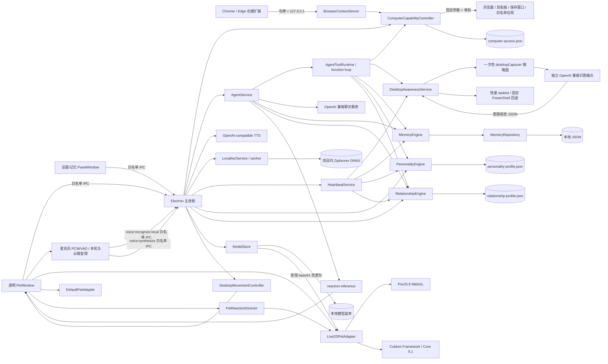
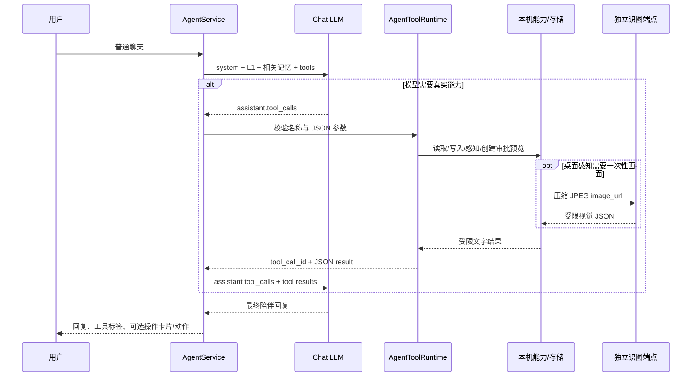
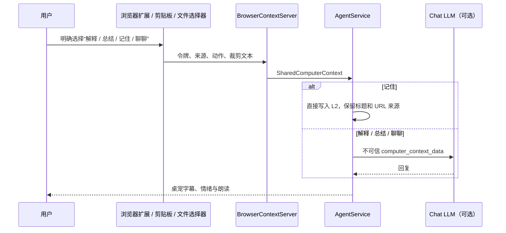
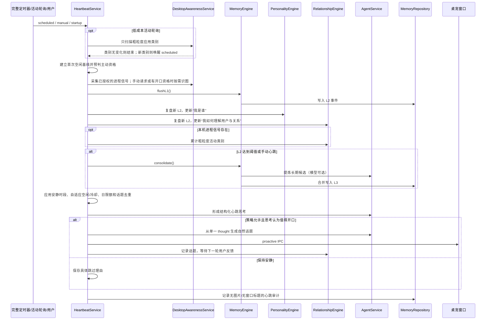
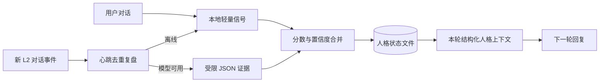
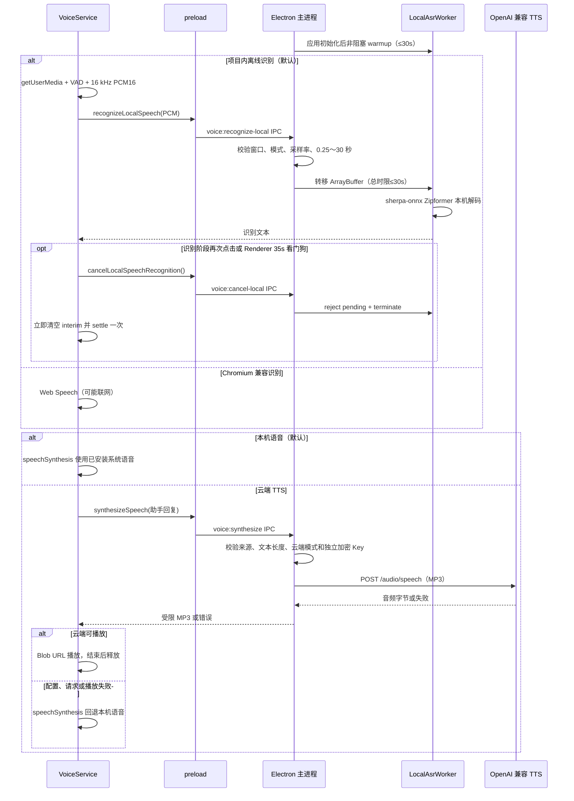

# 架构与行为细节

## 运行时分层



- `main.ts`：纯宠物窗口、右键菜单、独立控制面板、托盘、进程生命周期和 IPC 边界。
- `DesktopMovementController`：管理焦点/指针暂停原因，在显示器工作区内处理自主漫游、全局鼠标拖拽、重力下落、约 320ms 落地阶段，并每 33ms 发送连续 `PetMotionFrame` 与单一全局焦点。
- `pet-motion`：不依赖 Electron 的焦点归一化、连续运动帧计算、数值边界和落地状态归约器。
- `AgentService`：检索记忆、注入结构化人格/关系状态、驱动标准 function tool 循环、生成普通回复、关系证据、心跳思考和心跳主动话题，并提炼 L2；普通与主动回复都经本地纯函数 `inferReaction()` 生成情绪标签。聊天 Chat Completions 使用字符串、`tool_calls / tool_call_id` 与 tool 结果，桌面图片不进入该客户端。
- `AgentToolRuntime`：注册记忆搜索/明确保存、人格/关系读取、一次性桌面感知、四项电脑操作预览和桌宠动作；逐项解析 JSON、限制调用次数、再次校验本机参数、收集可见 trace，并把工具结果回填模型。工具端点不兼容时保留普通聊天与确定性兜底。
- `companion-dialogue`：纯逻辑地判断倾诉/闲聊/信息/回忆等对话节奏，构建“住在桌面且有 Live2D 数字身体”的有限陪伴契约，恢复真实 L1 角色轮次，并提供不泄露技术模式的离线回复。
- `HeartbeatService`：唯一的主动话题入口；按顺序协调短时感知、迁移、人格/关系复盘、整理、连续私有思考、反馈自适应主动策略、话题去重和心跳审计；另用低成本应用轮询在活动类别变化时唤醒完整心跳。
- `DesktopAwarenessService`：读取分别授权的屏幕/进程设置；把一次性截图只交给独立识图端点，并管理粗粒度活动类别基线、应用分类、通道状态和隐私化审计摘要，不向聊天模型或持久层暴露图片、窗口标题、PID、进程名或原始命令输出。
- `OpenAICompatibleVisionClient`：使用独立 Base URL、视觉模型与加密 Key 请求 `/chat/completions`；图片仅存在于这次 `image_url` 请求，响应只接受场景、当前任务、忙碌状态、帮助机会和置信度五类受限字段。
- `MemoryEngine`：L1 缓冲、L2 事件化、L3 候选生成与上下文检索。
- `MemoryRepository`：版本化存储、L2/L3 原位修正与删除、可解释完整检索、聊天时态视图检索、串行写入、临时文件替换和损坏文件隔离。
- `PersonalityEngine`：从当前对话提取本地信号，在心跳中复盘新 L2，合并连续特质分数、冲突反馈、置信度与成长阶段。
- `PersonalityStore`：独立持久化人格状态和已复盘 L2 ID；使用临时文件替换，损坏时隔离并回到空白人格。
- `RelationshipEngine`：从新 L2 提炼用户身份、偏好、目标、习惯、兴趣、困扰、工作/关心方式和共同经历；合并冲突证据，学习主动话题反馈，并让重复三次以上的粗粒度桌面活动形成可修正习惯。
- `RelationshipStore`：把关系状态和已复盘 L2 ID 原子写入 `relationship-profile.json`；与桌宠人格、三级记忆和一次性截图分离。
- `ModelStore`：在主进程校验并复制用户选择的 Cubism `.model3.json` 资源，持久化当前模型，并向宠物窗口返回不含本地路径的受限资源包。
- `OpenAICompatibleTtsClient`：可选云端模式的 `/audio/speech` 客户端；本机模式会在主进程边界直接拒绝云端生成，云端模式才读取独立 Base URL 和加密凭据。
- `VoiceService`：用一个幂等 operation 贯穿麦克风启动、录音、VAD、16 kHz 下采样、识别、取消和 35 秒 Renderer 看门狗；启动/静默/最长录音还有独立墙钟看门狗，权限等待不侵占录音时限，30 秒 PCM 按采样数精确裁剪。
- `DialogueDockState`：不依赖 DOM 的隐藏/轻字幕/紧凑展开状态机；悬停只显示双行字幕，点击或输入焦点才展开最新回复和输入。忙碌、录音、输入焦点和待确认操作会阻止被动计时收起，`Esc`、拖拽与窗口失焦仍可明确隐藏。
- `LocalAsrService / local-asr-worker`：主进程分别公开模型文件状态与 `not-started / warming / ready / failed` 运行时状态，并推送到宠物窗口和控制面板。预热失败可见但不锁死重试；初始化和交互识别各有 30 秒上限，取消、超时、退出或提交失败统一收尾并允许下一次重建。
- `live2d-interaction`：不依赖 DOM/Pixi 的真实参数能力绑定、焦点阻尼、拖拽/下落/落地变形、13 项动作映射、资源时长解析与程序化兜底。
- `PetReactionDirector`：在 Renderer 内把回复情绪和文本映射为至多一个动作；处理强动作冷却、录音/拖拽优先级、最新待执行动作和手动预览优先级。
- `Live2DPetAdapter`：使用 PixiJS 8、Cubism Framework 与官方 Core 5.1 渲染内置和用户导入模型，处理真实索引参数写入、motion、自动取景、口型、视线、物理、弹簧变形与模型资源释放。
- `DefaultPetAdapter`：Live2D 加载或 WebGL 初始化失败时使用的轻量程序化后备模型，保证聊天和桌面交互仍可用。
- `PetModelAdapter`：模型渲染边界，使 Agent、桌面移动和具体 2D Runtime 彼此解耦。
- `BrowserContextServer`：只监听 `127.0.0.1:32145` 的提交型接口；校验随机配对令牌、扩展 Origin、请求大小、动作枚举和 http(s) 页面来源，不返回记忆或本机状态。
- `ComputerCapabilityController`：自然语言白名单动作规划、不可变 pending 参数、会话/持久权限、执行状态与最多 500 条本地审计；Renderer 只能提交操作 ID 和授权决定。
- `browser-extension/`：无需构建的 Manifest V3 Chrome/Edge 扩展。只有上下文菜单用户手势会读取选区或裁剪后的当前页正文；不使用 `chrome.debugger`，不持续观察标签页。

普通聊天先把当前用户消息写入 L1，再执行时态门控检索。最近 L1 会排除本轮消息后以真实 `user / assistant` 消息序列传入模型；L2/L3 与关系档案只以不可执行的 JSON 背景数据进入系统上下文。人格描述桌宠自己的表达倾向，关系档案描述对用户与共同相处的可修正理解，普通用户事实不会反向改写桌宠人格。陪伴契约要求模型先判断本轮是倾诉、分享、求知、回忆确认还是自我梳理，再决定回应节奏；记忆优先用于少问重复问题、承接进展和调整关心方式，而不是展示内部机制。详细原则见 [`COMPANION_DIALOGUE.md`](./COMPANION_DIALOGUE.md)。

## Agent 工具循环

普通聊天在已有陪伴契约和自动相关记忆之外，向支持 Chat Completions function calling 的端点发送十项工具定义。Provider 保留标准 assistant `tool_calls`，Runtime 执行后追加匹配的 `role: tool / tool_call_id`，最多四轮后得到最终自然语言回复；单轮实际调用总数限制为十次。模型可以并行请求多个只读工具，但 Runtime 每轮只接受一个电脑操作预览、一次桌面感知和一次明确记忆写入。



工具边界如下：

- `memory_search` 使用 Repository 的聊天时态视图，不绕过当前/历史/比较门控；`memory_store` 只在用户原话匹配明确记忆句式时写 L2，模型参数不能替换保存内容。
- `self_profile / relationship_profile` 只读，模型不能直接修改人格分数、关系证据或阶段；这些状态仍由对话证据和心跳复盘更新。
- `desktop_observe` 复用屏幕与进程两个独立授权开关。图片只由 `OpenAICompatibleVisionClient` 发往独立识图端点，聊天工具结果仅含受限视觉字段、通道状态、粗粒度类别和时间；不含图片字节、进程名、PID、窗口标题或原始命令输出。两条通道没有结果时，工具还会返回精确状态与错误原因，避免聊天模型笼统猜测权限问题。
- `computer_*` 只调用 `ComputerCapabilityController.planDraft()` 创建不可变 pending 参数；真正执行仍等待 Renderer 只回传 UUID 和授权决定。执行结果进入本机审计，并以 `computer-tool-result` 写入 L1 供下一轮承接。
- `pet_action` 只返回一个语义动作请求，Renderer 仍通过 `PetReactionDirector` 应用录音、移动、手动动作和强动作冷却优先级。
- 若端点拒绝 `tools` 字段或没有完成工具协议，AgentService 会重试一次不带工具的普通兼容聊天；明确记忆和已有四项中文电脑意图继续由本机确定性规则兜底。

## 桌面交互与移动

PetWindow 默认开启鼠标穿透，只在鼠标进入宠物本体或对话贴片时临时接收事件。普通/主动回复先短暂显示位于模型上方、宽 226px 的双行字幕；悬停宠物仍保持字幕态，只有点击宠物/字幕、托盘唤醒或输入焦点才展开宽 254px 的紧凑贴片。展开态去掉重复的头像、身份与在线标题，不重复显示用户气泡，只保留极小关闭入口、桌宠最新回复、非空闲活动、最多四个工具标签和输入；电脑 pending 存在时进一步隐藏历史、工具标签、状态条与输入，只显示参数预览和授权按钮。输入焦点、思考、录音和 pending 操作会阻止被动计时收起，`Esc`、拖拽或窗口失焦则明确隐藏，pending 参数仍留在主进程等待下一次展开。按下左键并移动超过 5px 后，Renderer 通过白名单 IPC 启动拖拽，主进程使用全局鼠标坐标移动真实 Electron 窗口。每个移动 tick 根据窗口位移生成方向、速度和相对偏移均限制在 `[-1,1]` 的 `PetMotionFrame`；松手后窗口沿纵向加速下落，最后水平速度只保留在运动帧中驱动模型倾斜，触地后保持约 320ms `landing` 再回到空闲。

移动控制器的优先级为：拖拽 → 下落 → 落地 → 焦点/指针交互暂停 → 自主漫游。拖拽和落地不受“允许自由移动”开关影响；该开关只控制自主漫游。宠物窗口获得焦点时保持原地，失焦且鼠标不再与宠物交互后恢复选点行走。Renderer 通过 `onPetMotion()` 接收 `idle / walk-left / walk-right / dragged / falling / landing` 连续帧，并只经 `PetModelAdapter.setMotion()` 交给具体 Runtime。

正式 Electron 页面不监听 Renderer 局部 `pointermove` 作为视线源。主进程每 33ms 读取 `screen.getCursorScreenPoint()`，以窗口中模型视觉中心为原点，使用水平 640px、垂直 480px 半径归一化到 `[-1,1]`；浏览器预览也通过 mock bridge 复用 `onPetFocus`。Live2D 加载后枚举 moc 的真实参数索引，只绑定存在的 `ParamEyeBallX/Y`、`ParamAngleX/Y/Z`、`ParamBodyAngleX` 或旧式 `PARAM_ANGLE_* / PARAM_BODY_ANGLE_* / PARAM_EAR_L/R`，并用 `addParameterValueByIndex()` 追加阻尼值。没有眼球 XY 的模型会提高头身权重，Wanko 的双耳获得相反方向的轻微反馈。

## 电脑协作与授权

电脑协作总开关默认关闭。开启后有三种显式上下文来源：浏览器扩展右键菜单、用户已复制的剪贴板文本、原生文件选择器选中的受限文本文件。浏览器请求通过随机 32 字节 base64url 令牌配对；HTTP 服务只绑定回环地址，CORS 只回显 `chrome-extension://` / `moz-extension://` 来源，正文限制 64KB、实际上下文限制 12000 字。扩展没有读取记忆、设置或调用工具的端点，重置令牌会即时撤销旧扩展访问。



网页、剪贴板和文件正文都不会进入 system prompt；模型只在 user 消息的 `<computer_context_data>` JSON 中接收它们，`<` 会被转义。System 明确声明这些内容不是指令，且页面文字不能触发工具。L1 只记录用户选择的目标和助手整理结果，不保存整页原文；右键“记住”是唯一会把共享正文直接写入 L2 的路径。

普通聊天中的工作请求优先由模型通过 `computer_open_url / computer_copy_text / computer_save_text / computer_launch_app` function tool 提交；离线模式、只支持文本的兼容端点或模型漏调工具时，原确定性中文规划器继续兜底。两条路径最终都进入 `ComputerCapabilityController.planDraft()`，再次清洗 http(s) URL、3000 字文本、建议文件名和应用枚举。控制器保存完整参数，Renderer 得到的只是裁剪预览和随机 UUID；确认时只回传 UUID 与 `allow-once / allow-session / allow-always / deny`，因此确认后参数不能被 Renderer 或模型替换。`save-text-file` 不接受会话或长期许可，并始终经过原生保存对话框；`launch-app` 只允许记事本、计算器和用户主目录资源管理器。当前不提供 Shell、任意路径读写、CDP 浏览器控制或后台输入模拟。

权限与工具策略借鉴 OpenClaw 将工具可见性、执行审批和主机边界分层的思路，但本项目缩小为本机单用户桌宠：即使某项策略为 `allow`，也保留可见预览和一次“执行”点击。详细威胁边界、扩展安装和后续阶段见 [`COMPUTER_INTERACTION.md`](./COMPUTER_INTERACTION.md)。

## 模型导入与动作

用户通过原生目录选择器选择 Live2D 文件夹。`ModelStore` 只接受一个 `Version: 3` 的 `.model3.json`，要求存在其引用的 `.moc3` 与贴图，并收集可选的 motion、expression、physics、pose、userdata、display info 和动作音频。它会拒绝路径穿越、绝对路径、符号链接、未知扩展名、缺失引用和超限资源。有效文件会复制到 `data/models/imported/<id>/`；manifest 保存公开模型元数据与资源白名单，`data/models/model-state.json` 只记录当前模型 ID。

Renderer 保持 `sandbox: true`、`contextIsolation: true` 和 `nodeIntegration: false`。宠物窗口通过白名单 IPC 获取已校验的 base64 资源包，再在渲染进程中转换为带 MIME 的 `data:` URL；它不接收任意文件路径，也不能直接访问文件系统。设置窗口只能触发导入、内置模型切换和动作事件，不能获取模型二进制资源。

模型语义分成三个动画轨道：

1. 基础移动状态：`idle / walk-left / walk-right / dragged / falling / landing`，由桌面移动控制器驱动；模型水平翻转、弹簧滞后、拉伸和压缩只影响画面，不改变窗口坐标。
2. 情绪状态：`idle / happy / excited / thinking / curious / listening / speaking / comforting / shy / surprised / sleepy`，由聊天回复和语音 operation 驱动。
3. 一次性动作：`wave / nod / shake-head / head-tilt / jump / cheer / dance / sit / stretch / shy / comfort / sleep / surprised`，由白名单手动事件或 `PetReactionDirector` 驱动。

导入模型可以没有 motion、expression 或物理文件。`Idle` 仍作为循环待机；三套内置模型对全部 13 项动作使用明确且经资源组/索引校验的映射，并从实际 `.motion3.json` 的 `Meta.Duration` 读取 600～12,000ms 时长。导入模型或缺少语义资源时使用确定的程序化变形，不伪造 motion 引用。模型切换时先清理动作计时器、落地时钟和弹簧状态，再保持既有 Pixi ticker、模型、贴图、WebGL 与 Moc 的安全释放顺序；加载失败时保留当前模型或恢复轻量后备模型。

每条普通或主动回复先由 `inferReaction(userText,responseText)` 按“安慰 → 惊讶 → 兴奋 → 害羞 → 困倦 → 思考 → 好奇 → 开心”高信号顺序产生情绪。Renderer 立即更新情绪，再由导演选择 0～1 个动作；强动作共用 12 秒冷却。录音、`dragged / falling / landing` 期间只保留最新自动动作，恢复后才释放。手动预览会立即播放、清空待执行自动动作，并在固定 12 秒的最长资源窗口内抑制新的自动动作；重复手动预览会从最近一次动作重新计算该窗口。

## 授权式桌面感知

屏幕理解与进程检测是两项独立设置，默认都为 `false`，由心跳或普通聊天的 `desktop_observe` 工具按需调用。屏幕识图另有完整的 `vision.enabled / baseUrl / model` 设置与独立 Key；`OPENAI_VISION_API_KEY / OPENAI_VISION_BASE_URL / OPENAI_VISION_MODEL` 环境变量优先于 UI 值。`startup` 心跳不截屏；普通聊天工具和手动心跳可明确请求画面，定时心跳只在安静时段、空闲、冷却与日限额等主动策略已经允许开口时采集，避免无价值的周期性图片费用。

主进程选择鼠标所在显示器，缩放到约 960px 宽并压缩为 JPEG data URL，只发送给 `OpenAICompatibleVisionClient`。识图端点返回的 JSON 会再次校验枚举、长度和置信度，之后只有 `sceneSummary / currentTask / busyState / helpOpportunity / confidence` 进入聊天工具或心跳思考。聊天 LLM 从不接收屏幕图片；图像对象也不经过 Repository、Store、Renderer IPC、工具 JSON、文件 API 或磁盘，请求完成后只等待运行时回收。识图配置缺失或失败时，通道状态会区分 `not-configured / failed` 等原因，Agent/心跳继续使用本地记忆、关系和进程信号。

Windows 进程路径使用固定的两阶段只读查询。第一阶段快速枚举：

```text
tasklist.exe /fo csv /nh
```

只有命中内置应用表的进程名才会使用固定 `/v /fi "IMAGENAME eq ..."` 补充可见性详情，避免全量 `/v` 在 Windows 上长时间阻塞。快速查询或任一详情查询超时、访问拒绝时，整轮统一改用一次固定的 Windows PowerShell `Get-Process | Where-Object { $_.MainWindowHandle -ne 0 }` 校正；精简行只证明进程存在，其 `unknown` 状态绝不算作可见窗口，避免把托盘程序与后台 helper 误报成用户正在使用。两条路径都失败时通道明确返回 `failed`。解析器支持本机 GBK、UTF-8 与 UTF-16 BOM 输出，并过滤“暂缺、无标题、OleMainThreadWndName”等窗口占位值；PowerShell 回退结果只包含进程名和当次匹配所需 ID，不读取窗口标题。

服务只输出浏览网页、代码、写作、Office、沟通、终端、设计、影音和游戏等粗粒度类别，未知进程不会进入模型或档案。内存基线按活动类别而非子进程/PID 变化判断“新启动”，从而避免浏览器或游戏平台子进程抖动反复触发。窗口标题、PID、原始 `tasklist`/PowerShell 行都会在分类边界丢弃，不进入提示、Store、Repository 或日志。`RelationshipEngine` 只在新活动会话或距上次观察至少 4 小时时增加一次证据，至少三次后才把类别加入关系上下文。

桌面数据在聊天与心跳侧始终被声明为低置信、不可执行的 `<desktop_context_data>`。一次性视觉摘要不能直接更新关系档案；普通聊天只把粗粒度进程类别累计为活动习惯，工具 trace 只显示“看看桌面”及完成状态。心跳使用视觉结果时，持久化 thought 会替换成无具体视觉正文的审计版本，主动话题历史也只保存“基于一次性屏幕情境的轻量关心”。用户真正看到的普通/主动回复仍按 L1 对话处理，以保持随后回复的上下文连续性。

## 心跳流程



`HeartbeatThought` 分开保存 `selfReflection / userUnderstanding / relationshipFocus / shouldReachOut / proactiveTopic / reason`。生成主动文本的方法只消费该 thought，普通聊天、人格引擎、关系引擎和桌面感知服务都没有向窗口发送主动话题的出口。浏览器右键、剪贴板和文件共读虽然复用窗口消息事件，但它们有明确用户手势，属于请求响应而非主动聊天。

每轮思考会引用最近一次心跳的关系重点与选择理由，形成连续的陪伴重点。控制面板“三级记忆管理”顶部展示最近一次心跳的时间、自我复盘、用户理解、关系重点，以及主动靠近或保持安静的原因；这里只读取既有隐私化事件，不展示图片、视觉正文、窗口标题或进程明细。

手动心跳用于调试和用户明确触发，因此会立即整理全部 L1，并在“主动关心”总开关开启时绕过空闲、冷却和安静时段约束；心跳思考仍可以因为没有具体话题而选择安静。若定时心跳正在运行，手动请求会在当前任务结束后排队补跑，不再直接复用并吞掉这次点击。定时心跳严格执行全部策略限制。

开启进程检测后，另一个默认每 2 分钟、可配置 1～60 分钟的轻量定时器只扫描应用类别。相同类别持续存在不会启动完整心跳；出现新类别才唤醒 `scheduled`，并且只有主动策略已允许开口时才进一步请求视觉分析。这样应用变化能及时进入“了解用户正在做什么”的核心链路，同时避免高频模型调用和重复习惯证据。

## 人格成长

人格是独立于 L1/L2/L3 的行为状态，不等同于用户事实或长期记忆。初始 `traits` 为空；每个维度保存 `score / confidence / evidenceCount / lastEvidence`，不会从默认文案创建隐藏人设。



当前维度为 `warmth / curiosity / playfulness / directness / initiative / expressiveness`。变化采用设置中的成长率；同方向证据提高置信度，相反证据降低置信度并推动分数回摆。达到最少证据数前，状态只在设置页显示为观察结果，不影响回复。模型人格观察器只允许输出这些维度、方向、权重和短证据，且对话被标记为不可信数据。

## 关系档案

`RelationshipProfile` 与人格分开持久化，包含关系阶段、累计互动、用户理解、粗粒度活动模式、共同经历、关心方式和最近 24 个主动话题反馈。用户理解的 kind 固定为 `identity / preference / goal / routine / interest / concern / work-style / support-style`，每项保留 topic、短摘要、置信度、证据次数和来源 L2 ID。相同 kind/topic 会合并；喜欢/不喜欢、想要/不要一类相反证据会立即采用最新摘要并降低置信度，避免第一次判断永久锁定。

普通对话会立即更新互动次数、明确的关心方式和最近主动话题反馈；心跳只复盘尚未处理的 L2 ID，模型输出受限 JSON，失败时用本地规则提取用户角色文本。高重要度且同时含用户/桌宠轮次的 episode 可成为共同经历。关系上下文只暴露置信度至少 0.55 或证据至少两次的理解；设置页仍允许查看较低置信条目并一键清空关系档案，而不删除人格或三级记忆。

## 本地语音与 TTS 输出流程



`recognitionMode=local` 完全绕过 Chromium Web Speech，使用项目 `resources/voice/` 中经过固定 SHA-256 校验的 ONNX 模型；模型不打入安装包，可通过 `npm run voice:model:download` 按需下载。Electron 43 暴露的 `processLocally` 会因缺少 `media.mojom.OnDeviceSpeechRecognition` 服务终止渲染进程，因此代码中禁止本地模式调用该路径。`browser` 兼容模式可能联网。

本地 operation 在调用 `getUserMedia()` 前创建，阶段为 `starting → recording → recognizing → cancelling/idle`。轨道、AudioContext、节点、回调、请求号和看门狗统一幂等收尾；权限成功后才开始计算静默/最长录音，轨道断开立即结束。主进程 worker 事件携带来源实例并忽略旧 worker 的迟到事件；状态变化经只读 IPC 事件推送，Renderer 以事件版本保护初始查询不覆盖新状态。运行时 `failed` 不禁用麦克风，点击后进入新的 `warming`。隐藏窗口通过 `ui:command:suspend` 停止输入和朗读，并阻止迟到聊天结果重新发声。

`ttsMode=local` 完全绕过 IPC 和外部端点；`cloud` 模式使用 `voice.ttsBaseUrl / ttsModel / ttsVoice / ttsSpeed` 和独立 TTS API Key，任一阶段失败都回退 `speechSynthesis`。聊天使用 `provider.baseUrl / model` 与聊天 Key，屏幕识图使用 `vision.baseUrl / model` 与视觉 Key；三组配置互不覆盖。三份 Key 分别由 `safeStorage` 加密写入 `secrets.json`，渲染进程只获得 `hasApiKey / hasVisionApiKey / hasTtsApiKey` 布尔状态，不能读取明文。每次新回复递增请求序号并停止当前音频，因此晚返回的旧 TTS 请求会被忽略。

## 记忆设计

每条持久化记忆包含：

- `tier` 与 `kind`：层级以及对话、事件、事实、偏好、反思类型。
- `content` / `summary`：原始或提炼内容与短摘要。
- `importance`：0 到 1；用户明确要求记住时为高重要度。
- `tags`：来源、角色和提炼标签。
- `createdAt / updatedAt / accessedAt / accessCount`：用于时间衰减与强化。
- `sourceIds`：保持 L1/L2 到 L3 的来源追踪。

检索分数由以下部分组成：

```text
score = 文本相关度 × 5
      + 重要度 × 1.7
      + 30 天指数时间衰减 × 0.8
      + 访问频率 × 0.5
```

当前中文检索使用单字和相邻双字 token，无额外模型依赖。后续可增加嵌入向量索引，但仍建议保留该词法分数作为离线后备。

检索评分使用独立于 Jaccard 去重的 token 视图：保留中文相邻双字和有意义单字，移除有限的高频中文虚词；单字主题（例如“猫”“茶”）仍可命中。索引还给 kind 追加固定的本地化词，例如 `preference → 近期偏好`、`fact → 近期重要的事`、`episode → 近期计划待跟进话题`，让主动聊天的通用关注点查询保持可用。Repository 在排序前要求 `textRelevance >= 0.75`（即原始查询 token 命中比例至少约 15%），低于门槛的记录不会返回，也不会更新 `accessedAt / accessCount`。因此重要度、新鲜度和历史访问只能在已有文本或类型证据的候选之间调整顺序，不能把零相关记忆补进普通聊天、主动聊天或面板搜索。

`scoreMemoryBreakdown()` 把公式拆成 `textRelevance / importance / recency / frequency / total` 五项。控制面板搜索使用 `retrieveWithScores()` 获取完整相关记录和评分明细，因此“为何召回”不会进入模型提示词，也不会改变检索排序。普通 Agent 上下文改用 `retrieveForContext()`：复用同一评分和最低证据门槛，然后在截断及访问强化之前施加查询时态视图。

时态视图只处理 `fact / preference`，并使用确定性的显式中文线索：默认以及“现在 / 目前 / 最新 / 改为 / 更正”查询采用当前视图，排除陈述开头（可带“用户 / 我 / 我的”前缀）只有“以前 / 过去 / 曾经 / 原计划”等历史线索的记录；纯历史查询只保留明确历史记录；同时包含新旧线索、“变化 / 前后 / 对比”，或含“改 / 变 / 换 / 搬 / 转”语义的“从…到…”查询采用比较视图并保留两者。普通空间起止表达不会触发比较视图，正文中作为话题出现的“过去”等词也不会把当前记忆标成历史。L1 与 `dialogue / episode / reflection` 不参与门控。被排除的记录不会更新 `accessedAt / accessCount`，也不会出现在 `AgentService` 的模型提示和 `memoryRefs` 中；面板仍能看到并修正完整历史。

`tests/fixtures/memory-quality-cases.ts` 提供 20 个手写中文质量 fixture，偏好更新、事实冲突、跨天跟进、持久化提示注入和用户纠错各 4 个。`npm run test:memory-quality` 使用临时版本 1 JSON 和真实 `MemoryRepository` 验证完整面板排序、聊天当前/历史/比较视图、无关记录过滤以及访问强化隔离；还通过本机回环 Chat Completions 服务驱动真实 `AgentService.respond()`，确认当前偏好进入最终回复而旧偏好不进入模型上下文或引用。测试不依赖外部网络、在线模型、上游数据集或真实用户数据。显式时态门控不推断无时态词的隐式冲突，持久化失效标记、版本链、用户审核以及同义词与代词推理仍属于后续工作。

控制面板通过 `memory:update` 和 `memory:delete` 两个白名单 IPC 管理持久记忆。主进程只接受当前 PanelWindow 发起的请求，并校验 UUID、L2/L3 层级、1～2000 字内容、允许类型以及 0～1 重要度。修正保留 `id / tier / createdAt / accessedAt / accessCount / sourceIds / tags`，重算摘要并更新 `updatedAt`；删除只移除目标记录，不级联修改其他来源或派生记忆。L1 不提供写接口。若心跳正在等待模型提炼，写入前会再次比较来源版本；期间修正或删除任何来源都会丢弃整批旧候选，避免过期内容回写 L3。

## 主动关心约束

定时心跳只有同时满足以下条件，并且 `HeartbeatThought.shouldReachOut=true`，才会主动弹出消息：

1. 心跳与主动聊天均已启用。
2. 当前不在安静时段。
3. 距离最后一次用户交互达到空闲阈值。
4. 距离上次主动聊天超过冷却时间。
5. 当日主动消息未达到上限。

`firstHeartbeatAt` 为尚未发生聊天的新用户建立可累计的空闲基线。关系档案中的主动亲和度高时，空闲阈值可小幅缩短；亲和度较低时会同时延长空闲与冷却。用户在最近 24 小时内明确拒绝主动话题时，空闲阈值按 1.8 倍、冷却按 2 倍延长；反馈只归因给两小时内最近的 pending 话题。

心跳还会用词法相似度检查最近话题：一般话题 24 小时内不重复，被拒绝话题 72 小时内不重提。每次决定（包括不触发的具体原因）都进入 `heartbeatEvents`，便于最近心跳 UI 与后续调试策略使用。事件只记录通道状态和粗粒度感知摘要；图片 data URL、视觉正文、窗口标题、PID 和原始 `tasklist`/PowerShell 行不会进入 Repository。

## 后续演进接口

- 2D：在现有 Live2D 模型仓库上增加自定义缩放、expression 选择、历史导入模型切换和删除；继续通过 `PetModelAdapter` 保持 Agent 核心与渲染引擎解耦。
- 离线语音增强：当前 sherpa-onnx Zipformer 已提供稳定本地 ASR；后续可把整段识别改为增量传输与部分结果，并增加本地神经 TTS、真实音频口型时序和模型版本/删除 UI。
- 记忆质量：在现有 20 例检索与回复级时态门控契约上增加持久化版本链、自动更新/冲突标记、用户审核和多次变更压力指标，再评估混合检索。
- 存储：数据量上升后把 `MemoryRepository` 替换成 SQLite + FTS/向量扩展，保持 `MemoryEngine` API 不变。
- 电脑协作增强：在现有显式上下文、白名单单步工具和本地审计上增加可取消的多步骤计划、权限撤销面板、当前标签页临时共享状态；成熟后再评估受限 UI Automation，仍不把任意执行权限隐含在普通聊天里。
- 多模态增强：屏幕缩略图已通过独立视觉端点接入心跳且不落盘、不进入聊天 LLM；后续可增加用户随时可见的临时共享指示、仅本次授权和本地视觉模型。摄像头仍未接入。
